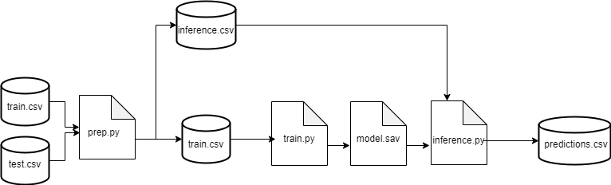

# APD_tarea_3

* [.pytest_cache/](.\APD_tarea_3\.pytest_cache)
  * [v/](.\APD_tarea_3\.pytest_cache\v)
    * [cache/](.\APD_tarea_3\.pytest_cache\v\cache)
      * [lastfailed](.\APD_tarea_3\.pytest_cache\v\cache\lastfailed)
      * [nodeids](.\APD_tarea_3\.pytest_cache\v\cache\nodeids)
      * [stepwise](.\APD_tarea_3\.pytest_cache\v\cache\stepwise)
  * [.gitignore](.\APD_tarea_3\.pytest_cache\.gitignore)
  * [CACHEDIR.TAG](.\APD_tarea_3\.pytest_cache\CACHEDIR.TAG)
  * [README.md](.\APD_tarea_3\.pytest_cache\README.md)
* [data/](.\APD_tarea_3\data)
  * [inference.csv](.\APD_tarea_3\data\inference.csv)
  * [predictions.csv](.\APD_tarea_3\data\predictions.csv)
  * [prep.csv](.\APD_tarea_3\data\prep.csv)
  * [test.csv](.\APD_tarea_3\data\test.csv)
  * [train.csv](.\APD_tarea_3\data\train.csv)
* [logs/](.\APD_tarea_3\logs)
  * [20240309_191051_prep.log](.\APD_tarea_3\logs\20240309_191051_prep.log)
  * [20240309_191340_prep.log](.\APD_tarea_3\logs\20240309_191340_prep.log)
  * [20240309_193826_prep.log](.\APD_tarea_3\logs\20240309_193826_prep.log)
  * [20240309_201830_prep.log](.\APD_tarea_3\logs\20240309_201830_prep.log)
  * [20240309_205757_train.log](.\APD_tarea_3\logs\20240309_205757_train.log)
  * [20240309_210525_train.log](.\APD_tarea_3\logs\20240309_210525_train.log)
  * [20240309_210913_train.log](.\APD_tarea_3\logs\20240309_210913_train.log)
  * [20240309_210957_inference.log](.\APD_tarea_3\logs\20240309_210957_inference.log)
* [notebooks/](.\APD_tarea_3\notebooks)
  * [Tarea1.ipynb](.\APD_tarea_3\notebooks\Tarea1.ipynb)
* [src/](.\APD_tarea_3\src)
* [__pycache__/](.\APD_tarea_3\__pycache__)
  * [test_utils.cpython-311-pytest-8.1.1.pyc](.\APD_tarea_3\__pycache__\test_utils.cpython-311-pytest-8.1.1.pyc)
  * [utils.cpython-311.pyc](.\APD_tarea_3\__pycache__\utils.cpython-311.pyc)
* [config.yml](.\APD_tarea_3\config.yml)
* [inference.py](.\APD_tarea_3\inference.py)
* [model.sav](.\APD_tarea_3\model.sav)
* [prep.py](.\APD_tarea_3\prep.py)
* [README.md](.\APD_tarea_3\README.md)
* [test_utils.py](.\APD_tarea_3\test_utils.py)
  * (================================================= test session starts =================================================
platform win32 -- Python 3.11.4, pytest-8.1.1, pluggy-1.4.0
rootdir: C:\Users\javie\OneDrive - INSTITUTO TECNOLOGICO AUTONOMO DE MEXICO\MaestriaEnCienciaDeDatos\4toSemestre\ArquitecturaDeProductosDeDatos\Tareas\Tarea3\APD_tarea_3
plugins: anyio-4.0.0
collected 3 items

test_utils.py ...                                                                                                [100%]

================================================== 3 passed in 1.30s ==================================================)
* [train.py](.\APD_tarea_3\train.py)
* [utils.py](.\APD_tarea_3\utils.py)

## Arquitectura

